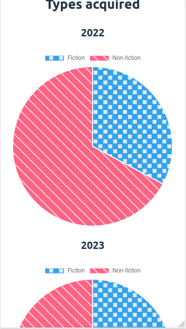
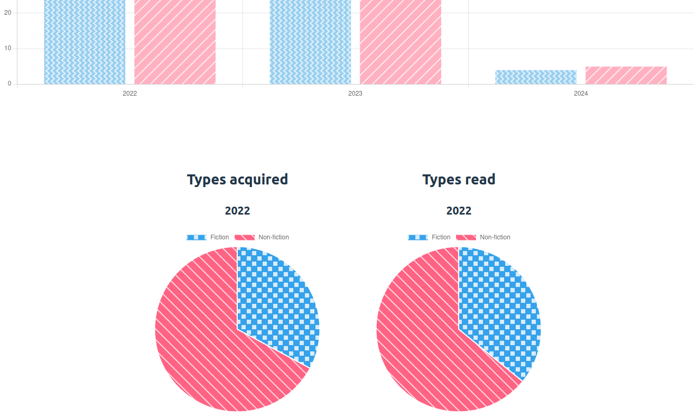

# Book Charting

Charting data about books I've read

## Table of contents

- [General info](#general-info)
- [Screenshots](#screenshots)
- [Technologies](#technologies)
- [Setup](#setup)
- [Status](#status)

## General info

I've been tracking my books acquired and read since 2022, so I thought it would be interesting to create some charts using that data.

## Screenshots




## Technologies

- TypeScript
- Express
- CSS
- ChartJS
- Google Sheets

## Setup

To view this project visit the [demo](https://book-charting-nm.onrender.com) or run it locally. Note this is hosted on a free tier of Render so will take 30 seconds to start up.

To run it locally, you will need to download the files and create a Google Spreadsheet with the following columns:

| Books acquired | Books read | Type | Category

Each sheet should hold data from a different year. The first row will be the headers and the data will start on the second row. If that year you've acquired a book and haven't read it, then the cell for books read should be blank. If that year you've read a book which you acquired in a previous year, then the cell for books acquired should be blank. Type is fiction/non-fiction. Category can be anything you like, up to a maximum of 21 different categories.

You'll then need to [use this link and follow the instructions](https://developers.google.com/sheets/api/quickstart/js) to set up the API for your sheet. Rename .env example to .env and add your API key and sheet ID to it.

Then open a terminal in the folder where you downloaded the files and install locally using npm:

```
npm install
```

Run the app locally:

```
npm run dev
```

## Status

Project is: _finished_
